# OpenClaw Files

<div align="center">

**基于 Electron + Python 的智能文件整理桌面工具**

通过 OpenClaw AI 分析目录结构，生成可确认、可执行、可回滚的文件整理方案，并扩展支持百度网盘同步与微信文件专项清理。

[](https://github.com/lpz7777777/OpenClaw_Files)
[](LICENSE)
[]()
[]()
[]()

</div>

---

## 📑 目录导航

- [项目简介](#-项目简介)
- [界面截图](#-界面截图)
- [核心能力](#-核心能力)
- [技术栈](#-技术栈)
- [安装与配置](#-安装与配置)
- [使用流程](#-使用流程)
- [支持的文件预览](#-支持的文件预览)
- [支持的操作类型](#-支持的操作类型)
- [项目结构](#-项目结构)
- [近期改动](#-近期改动)
- [打包与分发](#-打包与分发)
- [验证与排错](#-验证与排错)
- [常见问题](#-常见问题)

---

## 🎯 项目简介

OpenClaw Files 是一个围绕"本地文件整理"设计的桌面工作区：

- 📁 **左侧资源管理器** - 递归浏览当前目录结构
- 📄 **中间文档工作区** - 支持多标签预览 Word、Excel、文本等内容
- 🤖 **右侧分析面板** - 展示 OpenClaw 输出的整理摘要、分类建议和可执行操作
- ⚡ **底部执行链路** - 支持逐条确认、确认全部、失败自动丢弃和最近一轮回滚
- ☁️ **百度网盘同步** - 中间区域下方集成，可立即上传或创建每日同步任务
- 💬 **微信文件清理** - 专项入口，把微信文件从源目录整理到目标目录并自动归档

---

## 📸 界面截图

### 🖥️ 主界面

<div align="center">
  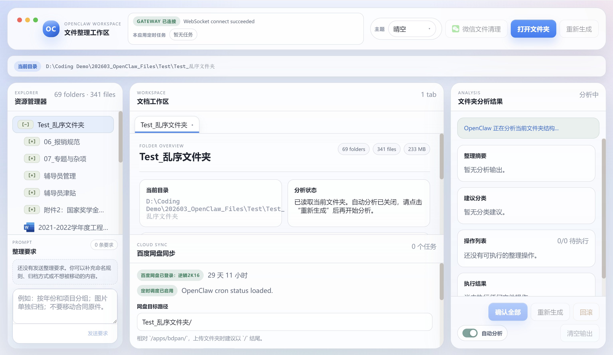
</div>

<div align="center">

**主界面** - 三栏工作区布局：左侧资源树、中间文档预览与云同步区、右侧 AI 分析与执行面板

</div>

---

### 🎨 主题展示

应用提供多套精美主题，默认以 **mac 主题** 启动：

<div align="center">

| 雾杉主题 | 北岸主题 |
|:-------:|:-------:|
| 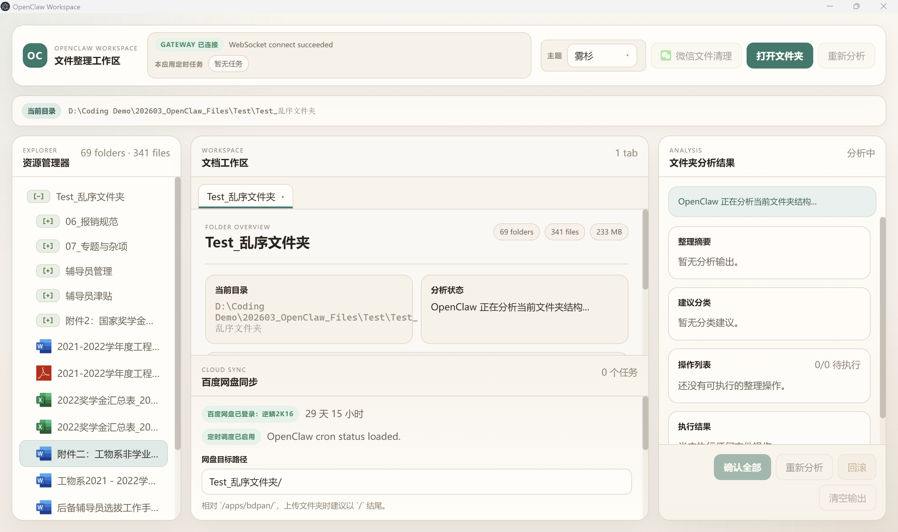 | 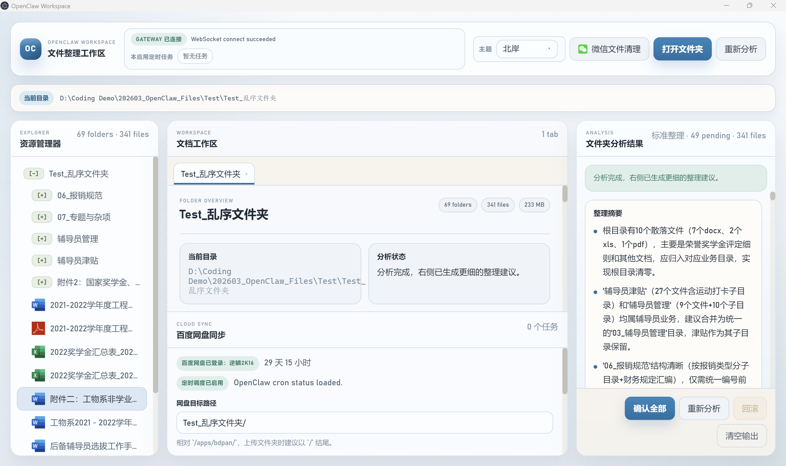 |
| 暖纸质感、沉稳配色 | 冷静蓝灰、工程线稿 |

| 琥珀主题 | 雨后主题 |
|:-------:|:-------:|
| 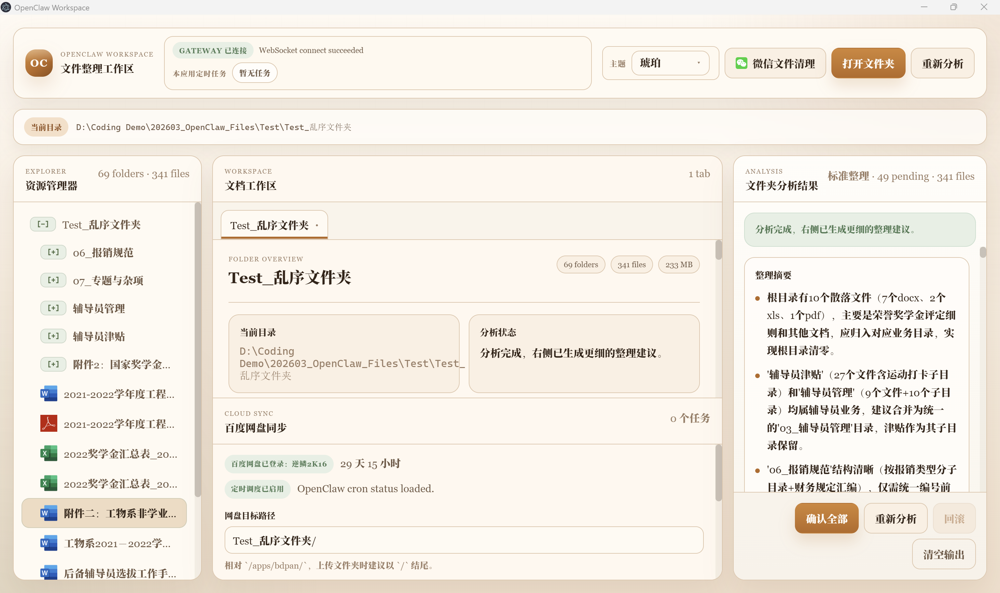 | 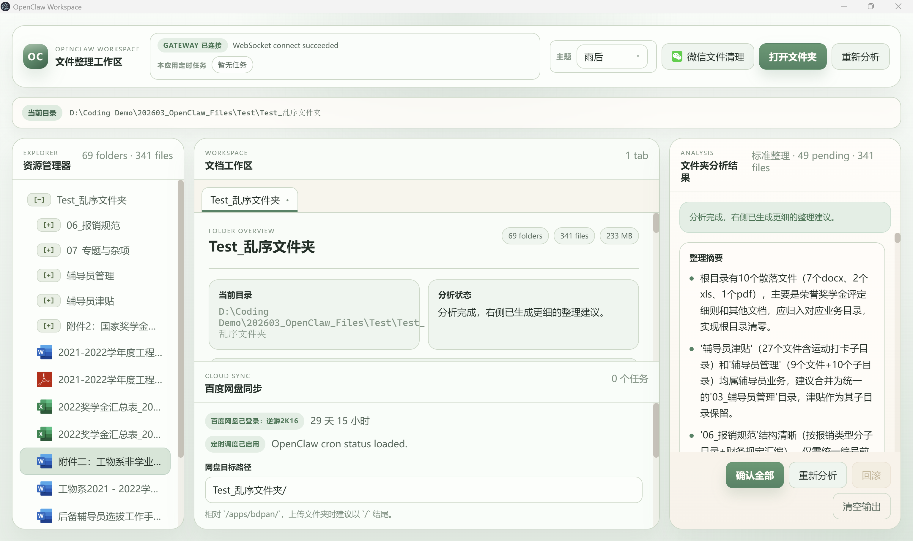 |
| 奶油纸页、琥珀点缀 | 低饱和绿调、柔雾背景 |

| 珊瑚主题 |
|:-------:|
| 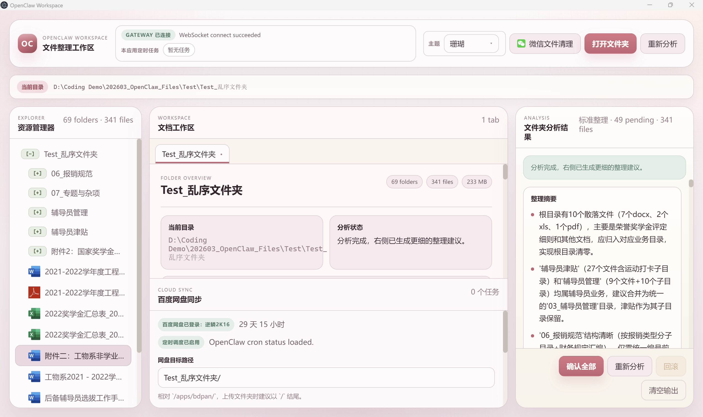 |
| 柔和珊瑚色、清晨云雾 |

每套主题都有独特的色彩风格和氛围，适合不同的使用场景和个人偏好。

</div>

---

### 📋 整理建议

<div align="center">
  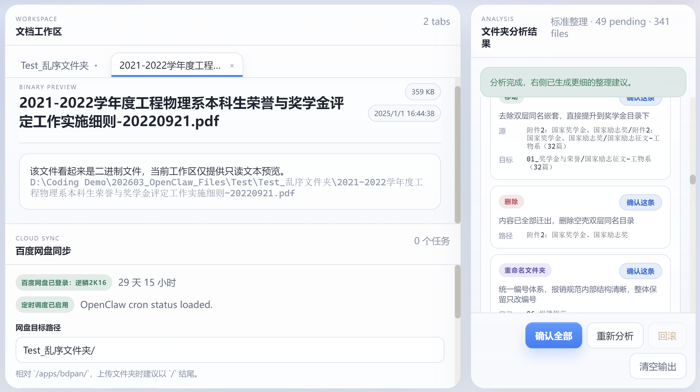
</div>

<div align="center">

**整理建议面板** - AI 分析生成的结构化整理方案，支持逐条确认或批量执行

</div>

---

### ☁️ 百度网盘同步

<div align="center">
  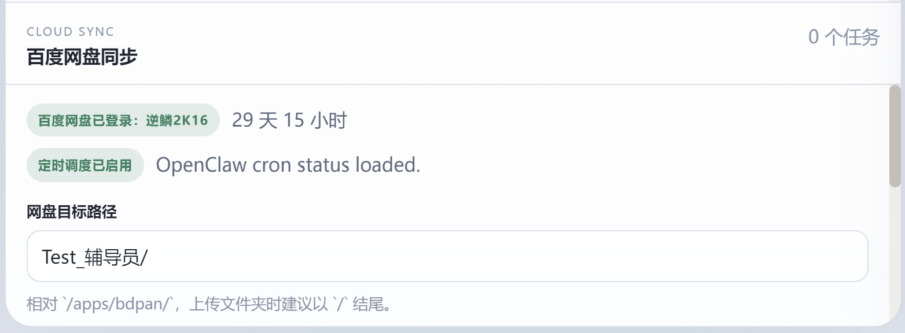
  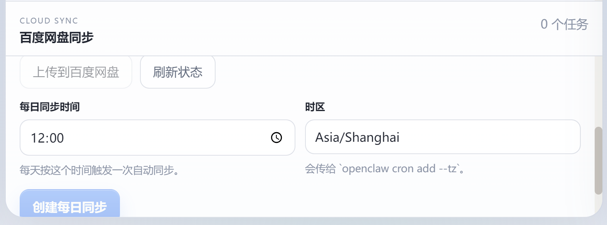
</div>

<div align="center">

**百度网盘同步** - 支持立即上传、设置每日同步时间、管理定时任务

</div>

---

### 💬 微信文件清理

<div align="center">
  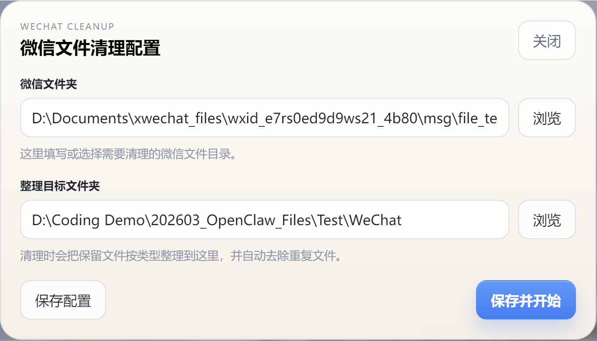
</div>

<div align="center">

**微信文件清理配置** - 右键点击配置源目录与目标目录，支持跨目录整理

</div>

---

### 🧹 普通文件夹整理前后对比

<div align="center">
  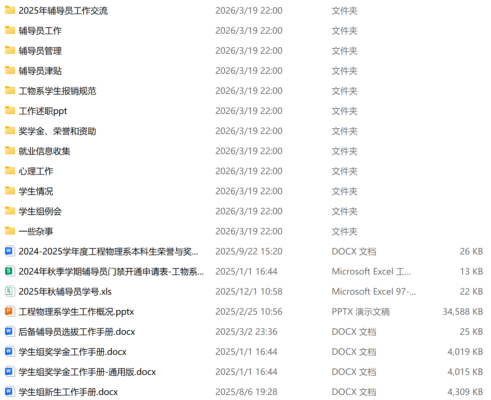
  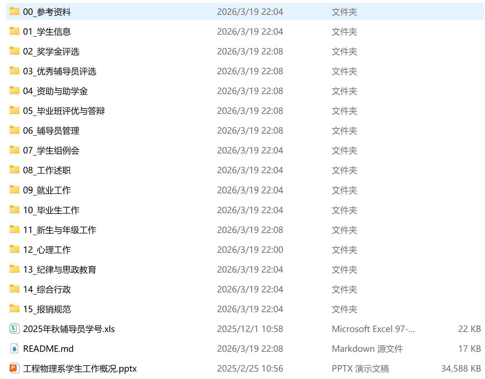
</div>

<div align="center">

**普通文件夹整理** - 左侧为整理前，右侧为整理后，AI 自动识别并归类文件

</div>

---

### 💬 微信文件整理前后对比

<div align="center">
  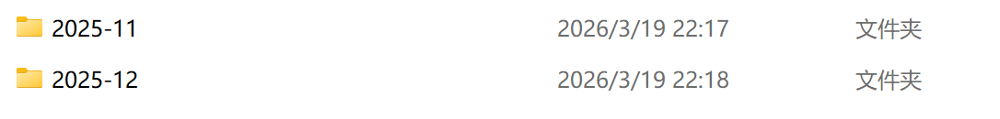
  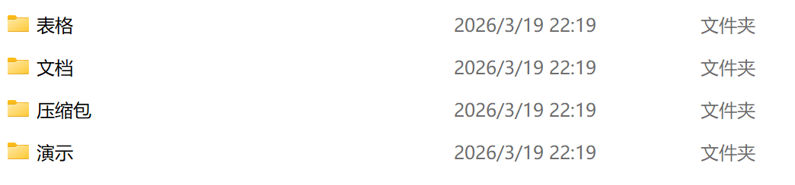
</div>

<div align="center">

**微信文件专项清理** - 左侧为整理前，右侧为整理后，按文件类型自动归档并去重

</div>

---

### ⚡ 整理过程与操作

<div align="center">
  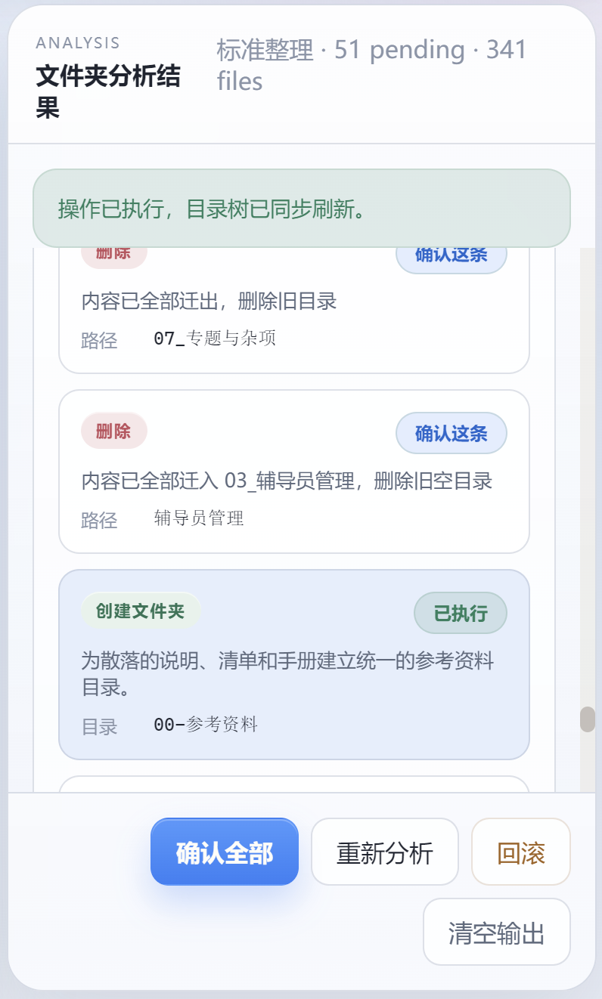
</div>

<div align="center">

**整理过程** - 支持逐条确认建议、批量执行、回滚操作等

</div>

---

### 📑 多标签页预览与管理

<div align="center">
  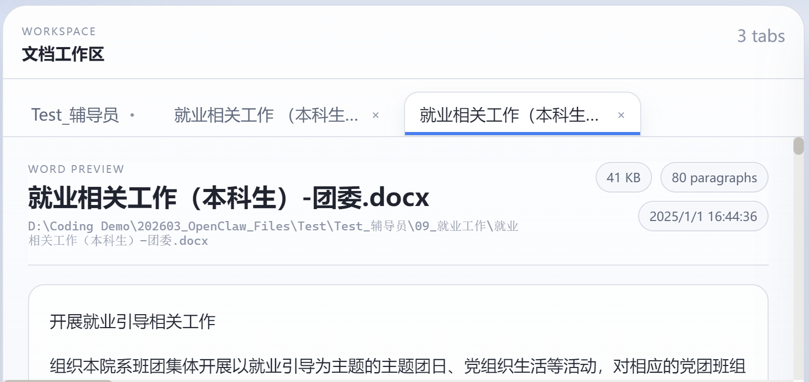
</div>

<div align="center">

**多标签页管理** - 同时预览多个文件，标签页切换方便高效

</div>

---

## ✨ 核心能力

### 🧠 智能整理工作流

- 🔍 递归扫描目录并构建 `folder_index` / `file_index`
- 🤖 由 OpenClaw 根据文件级信息生成更细的整理方案
- 📦 支持 `move`、`rename`、`rename_folder`、`create_folder`、`delete`
- ✅ 每条建议都可以单独确认，也可以一键执行全部
- ❌ 执行失败的建议会自动丢弃，避免整批流程卡死
- ↩️ 最近一轮操作可逆序回滚

### 💬 微信文件专项清理

- 🎯 顶部工具栏新增"微信文件清理"按钮
- ⚡ 左键可直接按已保存配置启动专项分析
- ⚙️ 右键弹窗可填写微信文件夹和整理目标文件夹
- 📂 源目录与目标目录分离，支持跨目录整理
- 🗂️ 自动按文件类型归档到目标目录
- 🔀 基于文件内容识别完全重复文件并自动去重
- ✅ 目标目录中已存在同内容文件时会自动按"去重成功"处理
- 🛡️ 遇到同名不同内容文件时自动改成安全文件名，避免覆盖

### 📄 文档预览与工作区

- 🖥️ 三栏工作区布局，适合边看目录边看建议
- 📑 中间工作区支持多标签页预览
- 📝 支持 Word `.docx`、Excel `.xlsx/.xls/.csv`、文本和代码文件预览
- 📊 根目录概览标签可查看当前目录摘要与统计信息

### ☁️ 百度网盘同步

- ⬆️ 可将当前目录立即上传到百度网盘
- ⏰ 支持设置"每日同步时间"与时区
- 📋 应用内可查看和取消当前应用创建的任务
- 📊 顶部栏会显示 Gateway 状态与任务概览
- 🪟 同时兼容 Windows 本机 CLI 与 WSL CLI

### 🛡️ 执行稳定性与安全性

- 🔄 `rename_folder` 支持安全合并已有目录
- 📍 后续操作可自动跟踪已改名目录路径
- 🎯 对轻微扩展名偏差、空格差异做模糊路径匹配
- 💾 `delete` 操作采用同盘临时备份区，便于回滚
- ✅ "源路径已不存在但目标已到位"会视为已成功应用
- 📄 确认全部后，只要本轮有成功执行的操作，就会在根目录生成结构说明 `README.md`

---

## 🛠️ 技术栈

| 层级 | 技术 | 描述 |
|:----:|------|------|
| 🎨 **前端** | Electron + HTML + CSS + JavaScript | 跨平台桌面应用界面 |
| 🐍 **后端** | Python + 内置 HTTP Server | 文件分析与执行引擎 |
| 🤖 **AI** | OpenClaw Gateway 或 Anthropic API | 智能整理方案生成 |
| 📁 **文件执行** | 本地文件系统操作 + 可回滚备份链路 | 安全可靠的文件操作 |
| ☁️ **同步能力** | OpenClaw CLI + bdpan CLI | 百度网盘同步支持 |

---

## 📦 安装与配置

### 1️⃣ 克隆仓库

```bash
git clone https://github.com/lpz7777777/OpenClaw_Files.git
cd OpenClaw_Files
```

### 2️⃣ 安装依赖

```bash
npm install
pip install -r requirements.txt
```

### 3️⃣ 配置环境变量

复制环境变量模板：

```bash
copy .env.example .env
```

#### 方式一：使用 OpenClaw Gateway（推荐）

```env
USE_GATEWAY=true
GATEWAY_URL=ws://127.0.0.1:18789
GATEWAY_TOKEN=openclaw-local-token
GATEWAY_AGENT_ID=main
GATEWAY_USER=main
GATEWAY_SESSION_KEY=agent:main:main
GATEWAY_MODEL=openclaw
GATEWAY_CLIENT_ID=gateway-client
GATEWAY_CLIENT_MODE=backend
GATEWAY_SCOPES=operator.read,operator.write
GATEWAY_TIMEOUT=60
GATEWAY_STATE_DIR=.openclaw-state
GATEWAY_AUTO_APPROVE_LOCAL_PAIRING=true
OPENCLAW_CLI_MODE=auto
BDPAN_CLI_MODE=auto
```

#### 方式二：直连 Anthropic API

```env
USE_GATEWAY=false
ANTHROPIC_API_KEY=your_actual_api_key_here
```

### 🪟 Windows 与 WSL 兼容说明

当前版本同时兼容以下两类安装方式：

- ✅ Windows 本机直接安装 `openclaw` / `bdpan`
- 🐧 仅在 WSL 内安装 `openclaw` / `bdpan`

**默认行为**为 `auto`：
1. 先尝试 Windows 本机 CLI
2. 找不到时自动回退到 WSL CLI

如需强制指定，可在 `.env` 中设置：

```env
OPENCLAW_CLI_MODE=auto
BDPAN_CLI_MODE=auto
OPENCLAW_WSL_DISTRO=Ubuntu
BDPAN_WSL_DISTRO=Ubuntu
```

---

## 🚀 启动

```bash
npm start
```

应用会同时启动：
- 🐍 Python 后端服务，默认端口 `8765`
- ⚡ Electron 桌面界面

---

## 📖 使用流程

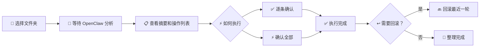

### 标准整理模式

1. 📂 打开一个本地目录
2. ⏳ 等待分析结果生成
3. 📋 查看分类建议、操作列表和整理摘要
4. ✅ 逐条确认或确认全部执行
5. ↩️ 如有需要，回滚最近一轮操作

### 💬 微信专项清理模式

1. 🎯 右键点击"微信文件清理"
2. ⚙️ 填写微信文件夹和整理目标文件夹
3. 💾 保存后左键启动分析，或直接"保存并开始"
4. 📊 查看按类型归档和去重后的整理方案
5. ✅ 确认执行，将文件归档到目标目录

---

## 📄 支持的文件预览

| 类型 | 扩展名 | 支持程度 | 图标 |
|:----:|--------|:--------:|:----:|
| 📝 **文本与代码** | `.txt` `.md` `.json` `.js` `.py` `.html` `.css` | 完整预览 | 📄 |
| 📖 **Word 文档** | `.docx` | 正文段落预览 | 📘 |
| 📊 **Excel 表格** | `.xlsx` `.xls` `.csv` | 首个工作表预览 | 📗 |
| 📕 **旧版 Word** | `.doc` | 兼容提示 | 📕 |
| 🗂️ **其他二进制** | 其他格式 | 占位提示 | 📦 |

---

## 🔧 支持的操作类型

| 操作类型 | 说明 | 安全机制 | 图标 |
|:--------:|------|:--------:|:----:|
| ➡️ **move** | 移动文件或文件夹到新位置 | 支持回滚 | 📦 |
| 🏷️ **rename** | 重命名文件 | 支持回滚 | ✏️ |
| 📁 **rename_folder** | 重命名或合并文件夹 | 安全合并模式 | 🗂️ |
| 🗑️ **delete** | 删除文件或目录 | 同盘临时备份区 | ❌ |
| ➕ **create_folder** | 创建新的分类目录 | 支持回滚 | 📂 |

### 🗑️ delete 备份机制

- 💾 删除的文件会先移动到同盘临时备份区
- ↩️ 回滚时从备份区恢复
- 🛡️ 避免跨盘删除或直接彻底丢失

### 🔍 启发式高置信识别

系统会自动识别以下模式并补充建议：

| 模式 | 建议类型 | 示例 |
|------|----------|------|
| 📦 已有同名解压目录的压缩包 | `delete` | `demo.zip` vs `demo/` |
| 📝 Office 临时文件 | `delete` | `~$document.docx` |
| 🔁 重复下载文件 | `rename` | `文件名 (1).docx` |
| 📁 父目录与同名包装子目录 | `move + delete` | `folder/folder/files` |

---

## 📁 项目结构

```text
OpenClaw_Files/
├── assets/
│   └── icons/              # 📁 文件类型与微信图标资源
├── backend/
│   ├── cloud_sync.py       # ☁️ 百度网盘同步能力
│   ├── command_runtime.py  # 🪟 Windows / WSL CLI 兼容层
│   ├── file_analyzer.py    # 🔍 文件分析、执行与回滚
│   ├── gateway_client.py   # 🤖 OpenClaw Gateway 客户端
│   └── server.py           # 🌐 HTTP 服务入口
├── screenshots/            # 📸 README 截图资源
├── DEV_LOG.md              # 📝 开发日志
├── index.html              # 🖥️ 主界面
├── main.js                 # ⚡ Electron 主进程
├── renderer.js             # 🎨 前端渲染逻辑
├── styles.css              # 💅 界面样式
└── README.md               # 📖 本文件
```

---

## 📝 近期改动

### 💬 微信文件清理

- ➕ 新增顶部"微信文件清理"按钮
- ⚡ 左键启动专项分析，右键打开配置弹窗
- 📂 支持源目录与目标目录分离
- 🗂️ 支持按文件类型归档、内容去重和安全命名

### 🎨 默认 mac 主题与图标资源升级

- 🚀 应用启动时默认进入 `mac` 主题
- 🎯 默认主题值也已切换为 `mac`
- 📁 资源管理器对常见文件类型切换为图片图标资源
- 💬 微信文件清理按钮加入微信图标

### ☁️ 百度网盘同步

- 📍 中间工作区下方集成百度网盘同步模块
- ⬆️ 支持立即上传、每日同步和任务取消
- 📊 启动时自动刷新顶部状态与任务概览

---

## 📦 打包与分发

### 构建安装包

```bash
npm run build
```

构建完成后，可在 `dist` 目录找到生成的 Windows 安装包。

### 💻 系统要求

| 要求 | 说明 |
|:----:|------|
| 🖥️ **操作系统** | Windows 10 或 Windows 11 |
| 🔧 **架构** | 64 位 |
| 💾 **内存** | 至少 4GB |
| 💽 **磁盘空间** | 至少 100MB 可用空间 |
| ☁️ **外部依赖** | 如需云同步，请安装 OpenClaw / bdpan |

---

## 🔍 验证与排错

### 🤖 Gateway 验证

```bash
python test_gateway.py
python discover_gateway.py
```

### 🔧 常用静态检查

```bash
node --check renderer.js
node --check main.js
python -m py_compile backend/file_analyzer.py backend/server.py backend/cloud_sync.py
```

---

## ❓ 常见问题

### Q: 为什么 Gateway 连接失败？

**A:** 检查以下几点：
1. ✅ 确认 OpenClaw Gateway 是否运行在指定地址
2. ✅ 检查 `.env` 中的 `GATEWAY_URL` 配置是否正确
3. ✅ 验证 token 和会话键是否有效
4. ✅ 使用 `test_gateway.py` 和 `discover_gateway.py` 脚本测试

### Q: 百度网盘同步不工作？

**A:** 确保：
1. ✅ 已安装 `bdpan` CLI 工具
2. ✅ 已登录百度网盘账号
3. ✅ 目标路径使用相对 `/apps/bdpan/` 路径
4. ✅ 检查后端日志中的具体错误信息

### Q: 微信文件清理找不到源目录？

**A:** 检查：
1. ✅ 微信文件夹路径是否正确
2. ✅ 是否有权限访问该目录
3. ✅ 路径格式是否为 Windows 绝对路径
4. ✅ 重新右键配置并保存

### Q: 如何回滚操作？

**A:** 
1. ✅ 仅支持回滚最近一轮操作
2. ✅ 点击右侧面板的"回滚"按钮
3. ✅ 确认回滚后，文件将恢复到操作前状态

---

## 📜 许可证

MIT License

---

## 📎 附录：GitHub 推送异常处理

如果你的全局 Git 配置把 GitHub 请求重写到 `gitclone.com`，在服务异常时可能会出现 `502`。可以用下面的方法恢复正常推送。

### 方案一：移除全局重写规则 ✅

```bash
git config --global --remove-section url."https://gitclone.com/github.com/"
git add .
git commit -m "提交信息"
git push origin main
```

### 方案二：临时覆盖 insteadOf

```bash
git -c url."https://github.com/".insteadOf= push origin main
```

### 方案三：直接修正远程地址

```bash
git remote -v
git remote set-url origin https://github.com/lpz7777777/OpenClaw_Files.git
git push origin main
```

---

<div align="center">

**Made with ❤️ by OpenClaw Files Team**

[⬆️ 返回顶部](#openclaw-files)

</div>
